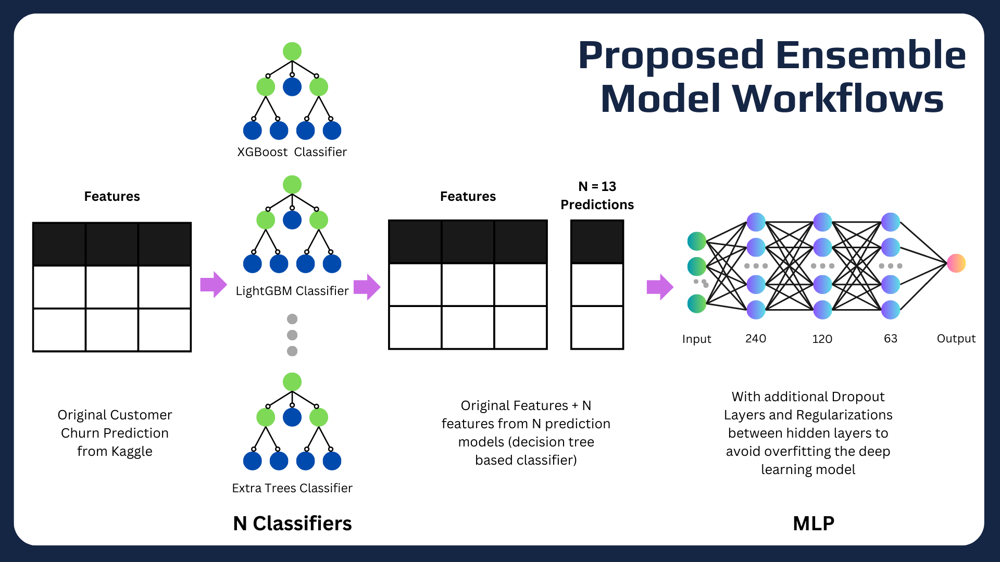
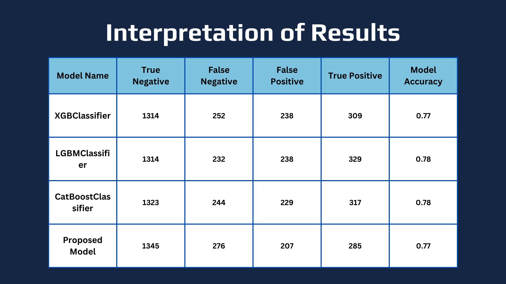

# Telco Churn Prediction

This project explores the effectiveness of integrating diverse model predictions into the training data for output forecasting. The research investigates the implications of this approach, particularly within Multilayer Perceptron (MLP) architectures. While initially promising, the integration of varied model predictions introduced complexities and noise, challenging the MLP’s capacity to effectively process this additional information. Moreover, limitations were observed in the original data’s capacity to enhance the proposed model’s performance. The findings highlight the need for cautious consideration of the value against the appended complexity when incorporating multiple model predictions into training data for neural network architectures.

    

Remark: This task is a final project of a Data Minning and Machine Learning Class. The title of this project is: "Customer Churn Rate Prediction: A Hybrid Machine Learning Model Integrating Data Analysis and Multilayer Perceptron (MLP)". The dataset is taken from Kaggle.

---

## Baseline Model

### XGBoostClassifier
XGBoost Classifier is a machine learning model for classification tasks, based on a gradient boosting decision tree. It efficiently handles complex and gigantic datasets. Apart from gradient boosting, it includes techniques such as regularization and parallel processing to build a comprehensive model quickly and efficiently. The advantages of this model ranges from robustness, scalability, and performance in diverse data fields. 

### LGBMClassifier
LightGBM Classifier is a fast and efficient machine learning model, similar to XGBoost Classifier, for classification problems. LightGBM can handle categorical features directly, whereas XGBoost requires them to be encoded. LightGBM often outperformed XGBoost Classifier in large and high-dimensional datasets due to its speed and lower memory requirements. 

### CatBoostClassifier
CatBoostClassifier stands out in machine learning for its exceptional handling of categorical data, offering high performance with minimal pre-processing. Its primary advantage over XGBoost and LightGBM is its ability to directly process categorical features without encoding, simplifying model preparation. While XGBoost excels in accuracy for smaller datasets and LightGBM in speed and efficiency for larger datasets, CatBoost strikes a balance, providing robust performance across various dataset sizes with a focus on reducing overfitting. Its user-friendly nature, requiring less hyperparameter tuning, makes it a practical choice, especially when dealing with complex data that includes multiple categorical features. 

NOTE: It's worth mentioning that there are other models that was taken into consideration when selecting the baseline model. These three models have similar approach and backboned algorithm, which is one of the improvement in the future by selecting more diverse model.

---

## Proposed Model

### Creating New Dataset for training the proposed model
1. Create an updated data frame by making predictions using each machine learning model with the resampled training data and replacing the values in the data frame
2. Create an updated data frame by making predictions using each machine learning model with the test data and replacing the values in the data frame
3. Create a new data frame based on the prediction result of the machine learning model by adding prediction results from all models into the original data frame. For creating a new dataset, L2 regularization, leaky ReLU, and dropout techniques are used. As a result, the new dataset has X features (from the original) + N (the number of machine learning models employed)

### Proposed Model Architecture

    

---

## Testing Result and Conclusion

    

The concept of integrating several model predictions into the training data to forecast outcomes appears promising. However, it turns out that this approach might introduce complexities and noise, potentially posing challenges for the MLP to effectively handle this added information. Moreover, it could be that the original data might not have sufficient information in order to increase the performance of the proposed model. As a result, it might not perform as effectively as robust baseline models such as XGBoost, LightGBM, and CatBoost. These models are suitable at handling complex relationships within data and tend to perform well in various situations. Their ability to handle noise, and maintain decent performance makes them preferable over MLP, especially when faced with the complexities introduced by incorporating additional predictions. Furthermore, these ensemble models often require less fine-tuning and are less likely to have problems with overfitting compared to deep learning models like MLP, making them a more suitable choice for this scenario.

--- 

## Thank you!
